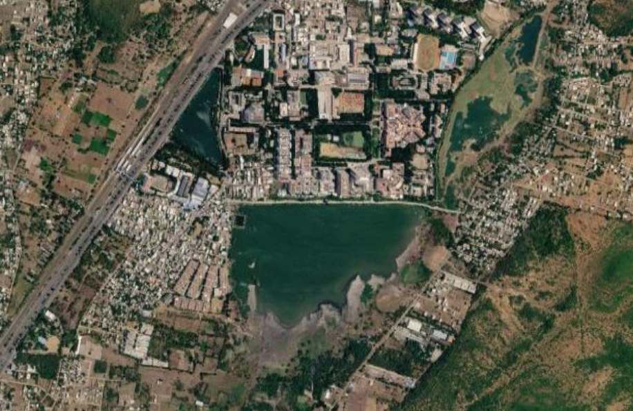
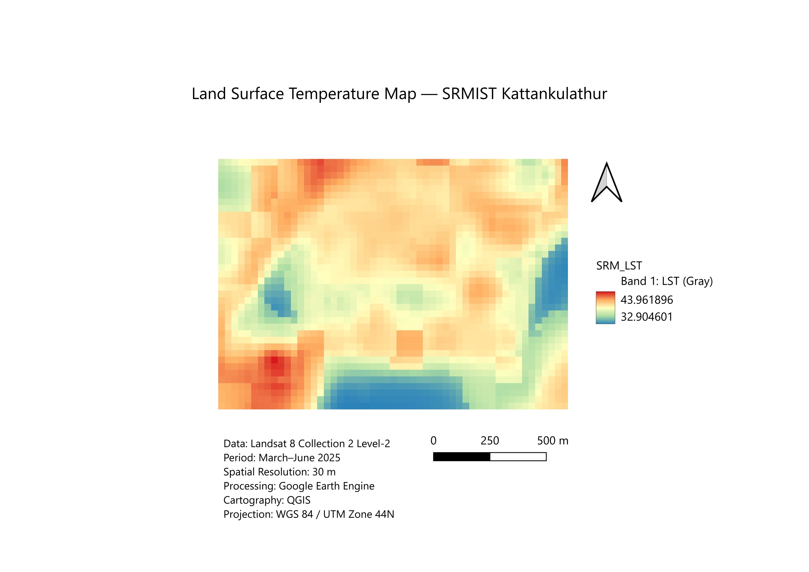
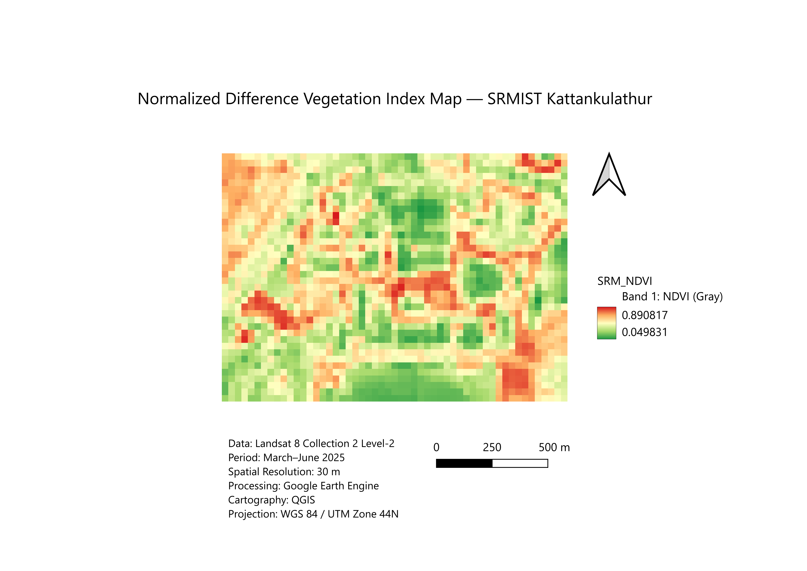

# Urban Heat Island Mapping - SRMIST Kattankulathur

## Overview

This project investigates spatial variation in land surface temperature
and vegetation across the SRMIST Kattankulathur study area using
Landsat 8, Google Earth Engine and QGIS.

## Objectives

- Calculate NDVI.
- Derive land surface temperature.
- Map spatial thermal variability.
- Analyze the relationship between NDVI and LST.
- Produce GIS-based thematic maps.

## Study Area

SRMIST Kattankulathur, Tamil Nadu, India.

Study period: March-June 2025.

## Data

Landsat 8 Collection 2 Level-2.

Spatial resolution: 30 m.

## Software

- Google Earth Engine
- QGIS
- GitHub

## Methodology

Landsat 8
→ Cloud filtering
→ Median composite
→ NDVI calculation
→ LST calculation
→ Statistical analysis
→ QGIS cartography

## Results

### NDVI

- Minimum: 0.0498
- Mean: 0.4432
- Maximum: 0.8908

### Land Surface Temperature

- Minimum: 32.21 °C
- Mean: 39.22 °C
- Maximum: 45.25 °C

### NDVI-LST Analysis

- NDVI < 0.2 mean LST: 37.90 °C
- NDVI > 0.5 mean LST: 39.04 °C
- Pearson correlation: 0.00386
- p-value: 0.90239

The Pearson correlation indicates essentially no statistically
significant linear relationship between NDVI and LST for the
selected study-area composite.

## Outputs

### LST Map

### NDVI Map

### Relationship Between NDVI and LST

## Tools

Google Earth Engine was used for satellite data processing and
QGIS was used for cartographic visualization.
